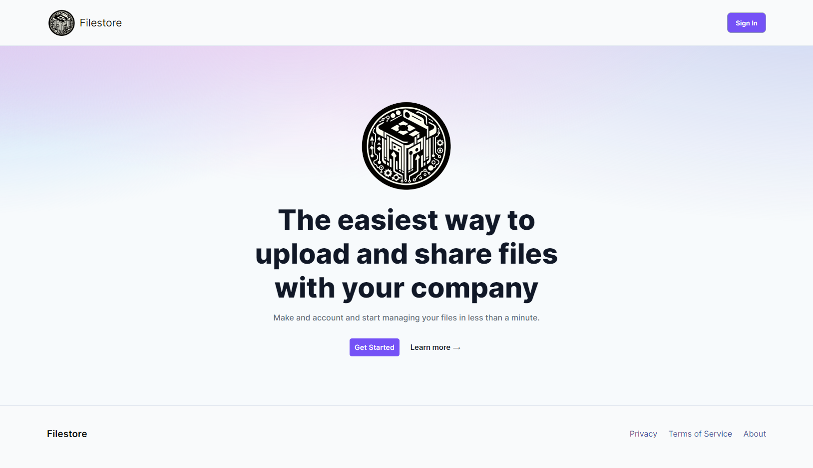
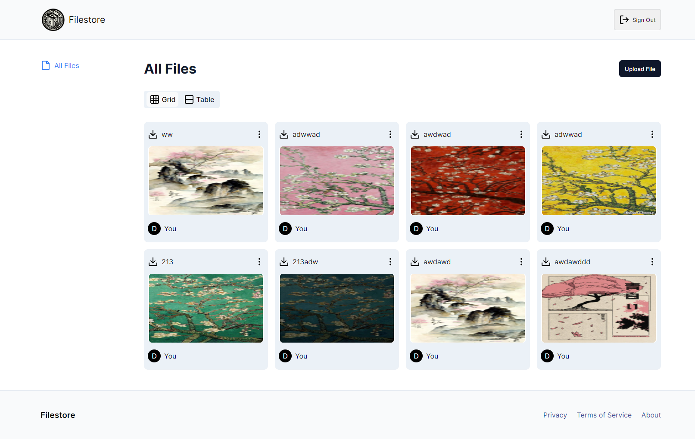
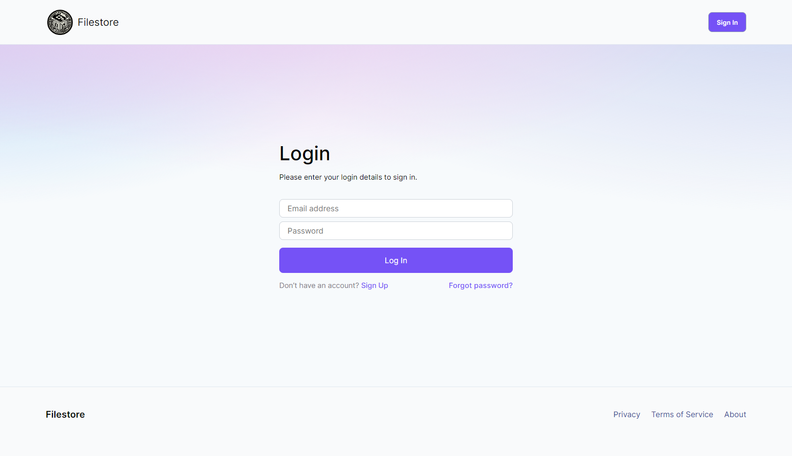
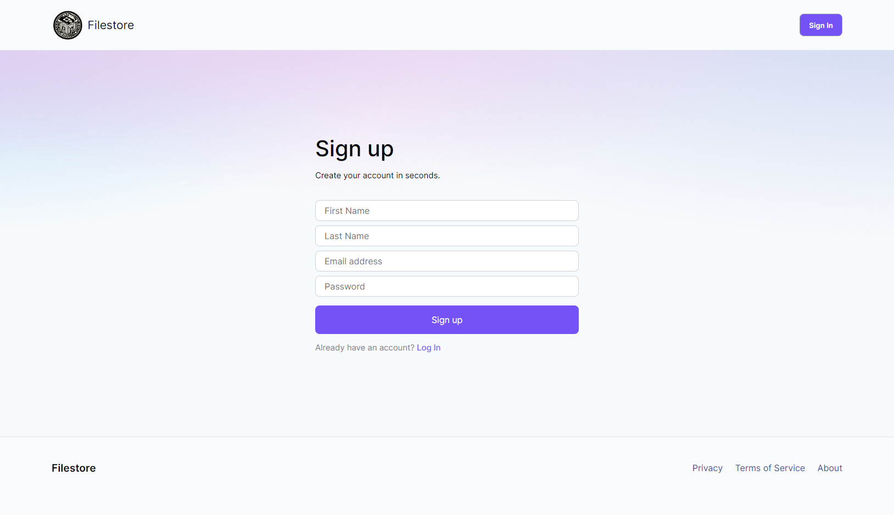

<h2>About project</h2>

File Drive is a cutting-edge file management app focused on storage and organization of digital assets. Developed with React and Firebase for authentication, it ensures security and accessibility.

👉 Live Demo: <a href='https://filestored.vercel.app'>Filestore Demo</a>

<h3>Built using:</h3>
» React  
» Firebase  
» Javascript 
» CSS  
» HTML 

 

<h2>Project Screenshots</h2>
 
<h3 align='center'>Home Page 🏠</h3>

  

  

<h3 align='center'>Files 📁</h3>

  

  
<h3 align='center'>Log in 🙇</h3>

  

  
<h3 align='center'>Sign up 🕳️</h3>

  

